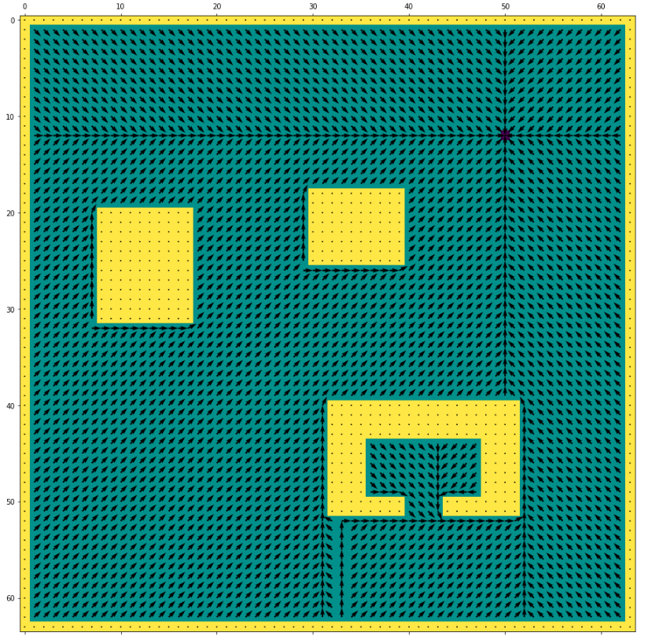
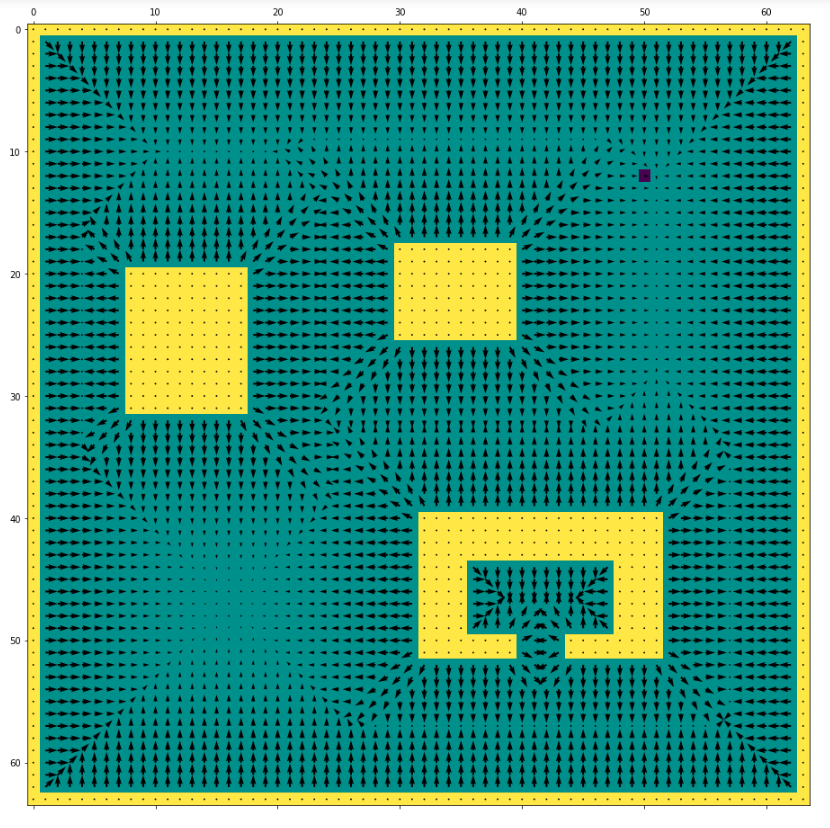
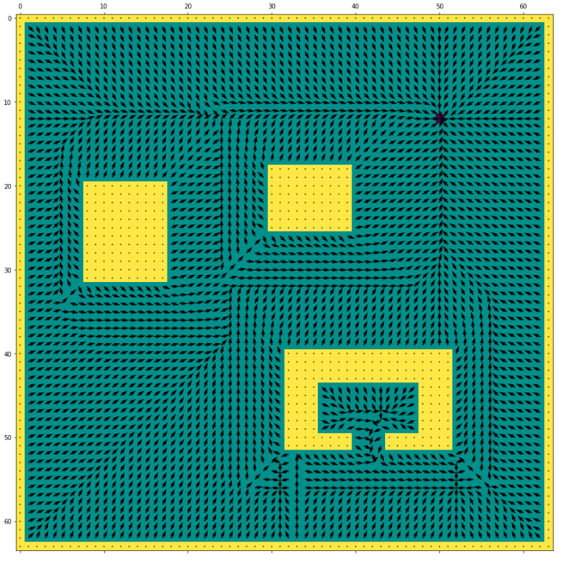

# Single Minimum Gradient Field Based Controller

## Install environment
`conda env create --prefix conda_env -f environment.yml`

`python setup.py develop`

## Description

Prototype implementation of a local minima free gradient field based controller in python. The gradient field combines an attractor and a repulsive field to compose the combined gradient field that by definition only has a single minima at the goal. This gradient field can then be controlled by a sufficiently designed controller, for which we also provide an example implementation.

The attractor field:

  

The repulsive field:

  

The combined field:

## More Descreption is coming soon.
